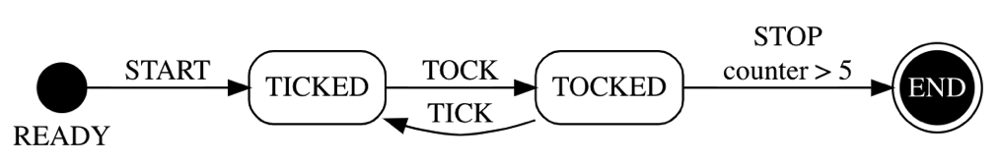

# an FSM library 

`sam-fsm` is a companion libray to the [sam-pattern](https://www.npmjs.com/package/sam-pattern). It provides a simple finite state machine implementation on top of the [SAM Pattern](http://sam.js.org) (which is itself a more robust state machine structure based on TLA+). `sam-fsm` supports deterministic and non deterministic state machines. Several FSMs can run concurrently in the same SAM instance, making it really easy do build sophisticated applications with complex state management needs. The two libraries combined enable you to use control states when they make sense and not needing any when the control states would be irrelevant to the application state mutations. It is just too cumbersome to specify a control state for all the actions, or a global state machine for your entire application state. `sam-fsm` + `sam-pattern` solves that problem.

## Table of Contents
- [Installation](#installation)        
  - [Node.js](#nodejs)        
  - [Browsers](#browsers)        
  - [Getting started](#getting-started)           
- [Library](#library)        
  - [Constructor](#constructor)        
    - [Parameters](#parameters)   
  - [Integration with SAM](#integration-with-sam)
    - [Next-Action predicates](#next-action-predicates)
    - [Transition guards](#transition-guards)
    - [Composite State](#composite-state)
    - [Exception Handling](#exception-handling)  
  - [Alternative specification formats](#alternative-specification-format)  
  - [State Diagram](#state-diagram)
- [Code samples](#code-samples)        
- [Support](#support)   
- [Change Log](#change-log)    
- [Copyright and license](#copyright-and-license)

## Installation

### Node.js
The library is available on [npm](https://www.npmjs.com/package/sam-fsm). To install it, type:

```sh
$ npm install --save sam-fsm
```

```javascript
const { fsm } = require('sam-fsm')

const simpleFsm = fsm({
  pc0: 'START_STATE',
  actions: {
    DO_SOMETHING: ['END_STATE']
  },
  states: {
    START_STATE: {
      transitions: ['DO_SOMETHING']
    }
  },
  deterministic: true,
  enforceAllowedActions: true
})

```

### Browsers
You can also use it within the browser; install via npm and use the ./dist/fsm.js file. For example:

```html
<script src="./node_modules/sam-fsm/dist/fsm.js"></script>

// or

<script src="https://unpkg.com/sam-fsm"></script>
```

```javascript
const { fsm } = tpFSM

const simpleFsm = fsm({
  pc0: 'START_STATE',
  actions: {
    DO_SOMETHING: ['END_STATE']
  },
  states: {
    START_STATE: {
      transitions: ['DO_SOMETHING']
    },
    END_STATE: {
      transitions: []
    }
  },
  deterministic: true,
  enforceAllowedActions: true
})

```

### Getting started

The FSM descriptor specifies:
- actions and their possible resuling states (more than one if not deterministic)
- states and their respective (allowed) actions to transition from
- the initial value of the state (`pc0`)
- whether the state machine is deterministic or not
- whether allowed transition need to be enforced
- an optional SAM component name, when you want the FSM to be deployed in that component's local state

Deterministic FSMs will mutate the `pc` variable for you. Non deterministic FSMs expect that you will provide one or more acceptors that mutate the `pc` variable with the current control state value.

Please note that `pc` is used commonly in TLA+ as the control state variable name and is itself in reference to [John Von Neumann's](https://en.wikipedia.org/wiki/Program_counter) `program counter` (also called `instruction pointer` in x86 architectures).

The `sam-fsm` library enables the interleaving between one or more FSM and a regular SAM state machine making it easier to use FSM semantics when they make sense without compromising the robust structure of a TLA+ based state machine. Of course, `sam-fsm` also supports FSM-only state machines, simply using SAM as the underlying implementation. 

The descriptor support both action and event semantics since actions are full-fledged SAM actions:
```javascript
  actions: {
    CALL_API: ['called'],
    ON_SUCCESS: ['succeeded'],
    ON_ERROR: ['failed']
  },
  states: {
    called: {
      transitions: ['ON_SUCCESS', 'ON_ERROR']
    },
    succeeded: {
      transitions: ['...']
    },
    failed: {
      transitions: ['CALL_API']
    }
  }
```

Let's take a look at the example of a clock:

```javascript
const {
  SAM, first, last, api, createInstance, doNotRender, utils: { E }, events
} = require('sam-pattern')

const { fsm } = require('sam-fsm')

// Instantiate clock fsm
const clock = fsm({
  pc0: 'TOCKED',
  actions: {
    TICK: ['TICKED'],
    TOCK: ['TOCKED']
  },
  states: {
    TICKED: {
      transitions: ['TOCK']
    },
    TOCKED: {
      transitions: ['TICK']
    }
  },
  deterministic: true,
  enforceAllowedTransitions: true
})

// Create a new SAM instance
const FSMTest = createInstance({ instanceName: 'FSMTest' })

// add fsm to SAM instance
const intents = FSMTest({
  initialState: clock.initialState({}),
  component: {
    actions: [
      // Labeled SAM actions
      ['TICK', () => ({ tick: true, tock: false })],
      [ 'TOCK', () => ({ tock: true, tick: false })]
    ],
    acceptors: clock.acceptors,
    reactors: clock.stateMachine
  },
  render: state => {
    console.log(state.pc)
  }
}).intents

const [tick, tock] = intents

tick()
tock()
```

Here is the new [Rocket Launcher example](https://codepen.io/sam-pattern/pen/XWNGNBy)

## Library

### Constructor
- `fsm`                   : Instantiates a new fsm 

#### Parameters
- `pc0`                   : initial state 
- `actions`               : an object where the keys are the action labels and the values the array of possible resulting states (one state only for deterministic state machines)
- `states`                : an object where the keys are the state labels and the values are allowed transitions from the corresponding state (as an array of action lables). States may optionally include `next-actions` that can be added to the next-action-predicate (nap) of a SAM instance
- `transitions`           : an alternative way to define the FSM specification (please see section on [Transitions](##alternative-specification-format))
- `composite`             : expresses that the current state machine is a composite state of another state machine
- `deterministic`         : a boolean value, `true` if the FSM is deterministic
- `enforceAllowedActions` : a boolean value, when `true` the acceptors will validate that a valid action is used to transition away from a state
- `pc`                    : a string that is used to rename the `pc` variable, `{ pc: 'status' }` will use `model.status` as the control state variable.
- `componentName`         : an optional SAM component name that will deploy the FSM in the SAM component local state tree
- `blockUnexpectedActions`: when true, uses the SAM allowedActions implementation to block unexpected actions. When several FSMs are running the collection of allowed actions is the sum of all expected actions.

### Integration with SAM

Start by creating a SAM instance as usual:
```
const SAMFSM = createInstance({ instanceName: 'SAMFSM' })
```

`sam-fsm` provides five integration points: `initialState`, `addAction`, `event`, `acceptors` and the `stateMachine` reactor.

Assuming your myFsm as the `sam-fsm` instance name:

```javascript
const intents = SAMFSM({
      initialState: myFsm.initialState(yourRegularSAMInitialState), // adds FSM specific hooks
      component: {
        actions: [
          action1, // a sam action, unrelated to the sam-fsm instance
          action2, // another regular sam action
          ['ACTION3', action3], // a labeled SAM action
          ['ACTION4', action4, mySecondFSM], // a labeled SAM action associated to a specific fsm
          myFsm.addAction(action4, 'ACTION_5') // another way to create a labeled SAM action
          myFsm.event('ON_SUCCESS') // creates a SAM action that publishes an event
        ],
        acceptors: [
          ...myFsm.acceptors, // the control state acceptors
          acceptor1, // 
          acceptor2
        ],
        reactors: [
          ...myFsm.stateMachine, // the sam-fsm 
          reactor1,  // a sam reactor, unrelated to the sam-fsm instance
          reactor2   // another regular reactor
        ]
      },
      render: state => { console.log(state) }
  })
```

FSM instance methods:

`initialState`    : wraps the SAM instance's intial state with the FSM internal variables (such as `pc`)

`addAction`       : wraps regular SAM actions

`event`           : instantiates a SAM action that publishes an event (the action presents the event label value as a proposal)

`acceptors`       : returns the fsm acceptors (as an array)

`stateMachine`    : returns the fsm reactor (as an array of 1 element)

`naps`            : returns the fsm next-action-predicates as a single, flat, array

From that point on, everything else is similar to a regular SAM instance, you can add additional acceptors, reactors (before or after the fsm ones) and naps as well.

`sam-fsm` supports SAM components and their local state. Several FSMs can be deployed in the same SAM instance, as long as you use a different `pc` variable but they can share actions!

#### Next-Action predicates

NAPs can be defined inline, in the state machine specification:

```javascript
...
states: {
    ticking: {
      transitions: ['TICK','LAUNCH','ABORT'],
      naps: {
        {
          condition: ({ counter }) => counter > 0,
          nextAction: (state) => setTimeout(_tick, 1000)
        },{
          condition: ({ counter }) => counter === 0,
          nextAction: (state) => setTimeout(_launch, 100)
        }
      }
    },
...
}
```

A NAP includes a condition and the next action as a function of the application state. The condition would be evaluated only when the control state is equal to its parent state.

The predicate triggers only when the state machine is in the given state (e.g. `ticking`)

Intents need to be wired manually due to the interdependency it creates between the fsm and the SAM instance.

#### Transition guards

The library supports transition guards which can be added to specific state transitions:

```javascript
const clock = fsm({
        pc: 'status',
        pc0: 'TOCKED',
        actions: {
          TICK_GUARDED: ['TICKED'],
          TOCK_GUARDED: ['TOCKED']
        },
        states: {
          TICKED: {
            transitions: ['TOCK_GUARDED'],
            guards: [{
              action: 'TOCK_GUARDED',
              // once the counter reaches 5, TICK_GUARDED and TOCK_GUARDED
              // are no longer allowed
              condition: ({ counter }) => counter < 5
            }]
          },
          TOCKED: {
            transitions: ['TICK_GUARDED'],
            guards: [{
              // The action name can be ommitted, in which case the first element of the transition
              // array will be used
              // action: 'TICK_GUARDED',
              condition: ({ counter }) => counter < 5
            }]
          }
        },
        deterministic: true,
        lax:false,
        enforceAllowedTransitions: true,
        blockUnexpectedActions: true
      })
```

As their name suggests the transition will only be possible while the condition is true. In the case above, the transition will be disallowed once the counter value is greater or equal to 5. The last transition allowed would increment the counter value to 5 and from that point on, the clock won't be able to `tick` or `tock`.

#### Composite State

Since a SAM instance can run multiple state machines, the `sam-fsm` library also supports the concept of `composite state` when a state machine can only accept actions when another state machine is in a particular state. The composite state fsm can also be specified to execute automatic actions on the parent fsm on specific states (success, failure,...)

The composite descriptor specifies the parent fsm composite state label (`COMPOSITE_STATE` in the snippet below). That state value acts as a global guard of the composite fsm. The composite fsm will start in the pc0 state each time the parent transitions to the composite state.

Conversely, the composite fsm can specify automatic actions on the parent fsm as composite transitions. On a given state (for instance `END`, the composite fsm will automatically execute the specified parent action and pass the proposal parameters (in addition to its own state)).

When the parent and/or composite fsm use their local states, the same logic applies.

```javascript
const parentFSM = fsm({ 
  pc: 'parentStatus', 
  states: {
    // Specify the parent state machine as usual including
    // the composite state
    COMPOSITE_STATE: { ... }
  },
  ... 
})

const compositeStateFSM = fsm({ 
        ...
        // a composite fsm is specified as a regular fsm
        // add a composite property that includes a
        // composite descriptor
        composite: {
          // a reference to the parentFSM
          of: parentFSM,
          // specify the parent composite state label, 
          // where it can be found (pc) and an optional
          // component name
          onState: { pc: 'parentStatus', label: 'COMPOSITE_STATE', component: 'optionalParentComponentName' },
          transitions: [
            // on reaching one ore more end states
            // trigger an intent and construct the proposal
            // from this list of properties from the model
            { onState: 'END', action: intentToTrigger, proposal: ['counter'] }
          ]
        }
        ...
})

// the SAM instance needs to be specified with labeled actions that also 
// include a reference to their respective fsm (parent, child1, child2, ...)
const intents = SAMFSM({
      ...
      component: {
        actions: [
          ['ACTION1', action1, parentFSM],
          ['ACTION2', action2, parentFSM],
          ['ACTION3', action3, compositeStateFSM],
        ],
      ...
})
```

#### Exception Handling

Exceptions are reported as SAM exceptions which can be accessed via these four SAM methods:
- `hasError`  
- `error`
- `errorMessage`
- `clearError`

For instance:

```javascript
render: (state) => {
  if (state.hasError()) {
    console.log(state.errorMessage())
    state.clearError()
  } 
}
```

### Alternative specification format

Some people prefer defining their FSM as a series of transitions. `sam-fsm` supports the following format:

```javascript
const transitions = [{
    from: 'ready', to: 'started', on: 'START'
  },{
    from: 'started', to: 'ticking', on: 'TICK'
  },{
    from: 'ticking', to: 'ticking', on: 'TICK'
  },{
    from: 'ticking', to: 'aborted', on: 'ABORT'
  },{
    from: 'ticking', to: 'launched', on: 'LAUNCH'
  },{
    from: 'aborted', to: 'ready', on: 'RESET'
  },{
    from: 'launched', to: 'ready', on: 'RESET'
  }]

const rocketLauncherStyle1 = fsm({ 
  pc0: 'ready', 
  transitions, 
  deterministic: true 
})

// or state - action - state
const stateActionState = {
        ready: {
          START: "started"
        },
        started: {
          TICK: "ticking"
        },
        ticking: {
          TICK: "ticking",
          ABORT: "aborted",
          LAUNCH: "launched"
        },
        aborted: {
          RESET: "ready"
        },
        launched: {
          RESET: "ready"
        }
      }

const rocketLauncherStyle2 = fsm({ 
  pc0: 'ready', 
  transitions: stateActionState, 
  deterministic: true 
})

```
You can also use the `fsm.actionsAndStatesFor` class method to translate transitions into states and actions (the transition style is detected automatically):

```javascript
const { pc0, states, actions } = fsm.actionsAndStatesFor(transitions)

// and then as usual
const rocketLauncherFSM = fsm({ pc0, states, actions })
```

The function uses the first `from` state as the start state (`pc0`) and adds `deterministic` and `enforceAllowedTransitions` properties. You can, of course, add reactors as necessary. These styles do not support NAPs.

### State Diagram

The fsm comes with a [graphViz formated](https://edotor.net/) state diagram. Here is [another editor](http://magjac.com/graphviz-visual-editor/)

```javascript
const clock = fsm({ ... })

console.log(clock.stateDiagram)

// should yield
digraph fsm_diagram {
rankdir=LR;
size="8,5"
READY [shape = circle margin=0 fixedsize=true width=0.33 fontcolor=black style=filled color=black label="\n\n\nREADY"]
END [shape = doublecircle margin=0 style=filled fontcolor=white color=black]
node [shape = Mrecord];
READY -> TICKED [label = "START"];
TICKED -> TOCKED [label = "TOCK"];
TOCKED -> TICKED [label = "TICK"];
TOCKED -> END [label = "STOP\n counter > 5"];
}
```

The diagram generator is capable of displaying conditions (see unit tests for an example):

The fsm is also capable of creating a representation of the runtime state diagram:
```
clock.runtimeStateDiagram()
```


## Code samples

[Rocket Launcher](https://codepen.io/sam-pattern/pen/XWNGNBy)

[sam-fsm without the sam-pattern library](https://codepen.io/sam-pattern/pen/abBejoV)

Please see [the unit tests](https://github.com/jdubray/sam-fsm/tree/master/test) for additional code samples

## Support

Please post your questions/comments on the [SAM-pattern forum](https://gitter.im/jdubray/sam)

## Change Log
- 0.9.24  RC2 `sam-fsm' is ready!
- 0.9.23  Adds indexed action to the runtime state diagrams
- 0.9.20  Adds support for runtime state diagrams
- 0.9.19  Adds support for composite state machine
- 0.9.17  Adds GraphViz state diagram
- 0.9.15  Adds tests for labeled SAM actions
- 0.9.12  Minifies the lib  (3.4kB)
- 0.9.11  Fixes minor defect, adds sample without `sam-pattern` library
- 0.9.10  RC1 `sam-fsm` is feature complete!
- 0.9.9   Adds support for SAM allowedActions mechanism (blocking unexpected actions)
          *** Breaking change *** the `send` instance method has been renamed `event`  
- 0.9.8   Adds support for transitions in the constructor (in addition to actions/states)
- 0.9.7   Adds support for localstate, new unit tests and cleans up doc and code sample
- 0.9.2   Adds `actionsAndStatesFor` and `flattenTransitions` to transform transitions into states and actions
- 0.9.1   Adds next-action-predicate in the fsm specification
- 0.8.9   Ready for community review

## Copyright and license
Code and documentation copyright 2021 Jean-Jacques Dubray. Code released under the ISC license. Docs released under Creative Commons.