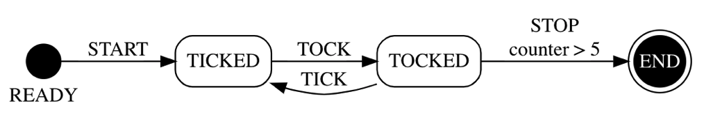

# SAM FSM Library

`sam-fsm` is a companion library to [sam-pattern](https://www.npmjs.com/package/sam-pattern). It provides a finite state machine implementation on top of the [SAM Pattern](http://sam.js.org) (which is itself a robust state machine structure based on TLA+). `sam-fsm` supports both deterministic and non-deterministic state machines. Several FSMs can run concurrently in the same SAM instance, making it easy to build sophisticated applications with complex state management needs.

The two libraries combined let you use control states where they make sense without being forced to model your entire application as a single FSM. It is too cumbersome to specify a control state for every action — `sam-fsm` + `sam-pattern` solves that problem.

## Table of Contents
- [Installation](#installation)
  - [Node.js](#nodejs)
  - [Browsers](#browsers)
  - [Getting Started](#getting-started)
- [Library](#library)
  - [Constructor](#constructor)
    - [Parameters](#parameters)
  - [Integration with SAM](#integration-with-sam)
    - [Next-Action Predicates](#next-action-predicates)
    - [Transition Guards](#transition-guards)
    - [Composite State](#composite-state)
    - [Exception Handling](#exception-handling)
  - [Alternative Specification Formats](#alternative-specification-formats)
  - [State Diagram](#state-diagram)
- [Code Samples](#code-samples)
- [Support](#support)
- [Change Log](#change-log)
- [Copyright and License](#copyright-and-license)

## Installation

### Node.js
The library is available on [npm](https://www.npmjs.com/package/sam-fsm). To install it, type:

```sh
$ npm install --save sam-fsm
```

```javascript
const { fsm } = require('sam-fsm')

const simpleFsm = fsm({
  pc0: 'START_STATE',
  actions: {
    DO_SOMETHING: ['END_STATE']
  },
  states: {
    START_STATE: {
      transitions: ['DO_SOMETHING']
    },
    END_STATE: {
      transitions: []
    }
  },
  deterministic: true,
  enforceAllowedActions: true
})
```

### Browsers
Install via npm and reference the pre-built bundle:

```html
<script src="./node_modules/sam-fsm/dist/fsm.js"></script>
```

The library's global name is `tpFSM`:

```javascript
const { fsm } = tpFSM

const simpleFsm = fsm({
  pc0: 'START_STATE',
  actions: {
    DO_SOMETHING: ['END_STATE']
  },
  states: {
    START_STATE: {
      transitions: ['DO_SOMETHING']
    },
    END_STATE: {
      transitions: []
    }
  },
  deterministic: true,
  enforceAllowedActions: true
})
```

### Getting Started

The FSM descriptor specifies:
- **actions** and their possible resulting states (one state only for deterministic machines)
- **states** and their respective allowed action transitions
- **pc0** — the initial control state
- **deterministic** — whether the FSM is deterministic
- **enforceAllowedActions** — whether to reject transitions not in the allowed set
- **componentName** (optional) — deploys the FSM into a SAM component's local state tree

Deterministic FSMs mutate the `pc` variable automatically. Non-deterministic FSMs require you to provide one or more acceptors that mutate `pc` with the current control state value.

> **Note:** `pc` follows TLA+ convention (program counter, in reference to [John Von Neumann's](https://en.wikipedia.org/wiki/Program_counter) instruction pointer).

`sam-fsm` supports both action and event semantics since actions are full-fledged SAM actions:

```javascript
actions: {
  CALL_API:   ['called'],
  ON_SUCCESS: ['succeeded'],
  ON_ERROR:   ['failed']
},
states: {
  called:    { transitions: ['ON_SUCCESS', 'ON_ERROR'] },
  succeeded: { transitions: ['...'] },
  failed:    { transitions: ['CALL_API'] }
}
```

Here is a minimal clock example:

```javascript
const {
  createInstance, utils: { E }
} = require('sam-pattern')

const { fsm } = require('sam-fsm')

const clock = fsm({
  pc0: 'TOCKED',
  actions: {
    TICK: ['TICKED'],
    TOCK: ['TOCKED']
  },
  states: {
    TICKED: { transitions: ['TOCK'] },
    TOCKED: { transitions: ['TICK'] }
  },
  deterministic: true,
  enforceAllowedTransitions: true
})

const FSMTest = createInstance({ instanceName: 'FSMTest' })

const { intents } = FSMTest({
  initialState: clock.initialState({}),
  component: {
    actions: [
      ['TICK', () => ({ tick: true, tock: false })],
      ['TOCK', () => ({ tock: true, tick: false })]
    ],
    acceptors: clock.acceptors,
    reactors: clock.stateMachine
  },
  render: state => console.log(state.pc)
})

const [tick, tock] = intents

tick() // -> TICKED
tock() // -> TOCKED
```

See also the [Rocket Launcher example](https://codepen.io/sam-pattern/pen/XWNGNBy).

## Library

### Constructor
- `fsm` — instantiates a new FSM

#### Parameters
- `pc0`                    — initial control state
- `actions`                — object where keys are action labels and values are arrays of possible resulting states (one element for deterministic machines)
- `states`                 — object where keys are state labels and values are objects with `transitions` (array of action labels) and optional `naps`
- `transitions`            — alternative way to define the FSM (see [Alternative Specification Formats](#alternative-specification-formats))
- `composite`              — marks this FSM as a composite state of another FSM
- `deterministic`          — `true` if the FSM is deterministic
- `enforceAllowedActions`  — when `true`, acceptors validate that only allowed transitions are used
- `pc`                     — renames the control state variable (e.g. `{ pc: 'status' }` uses `model.status`)
- `componentName`          — deploys the FSM in the named SAM component's local state tree
- `blockUnexpectedActions` — uses SAM's `allowedActions` mechanism to block unexpected actions; when several FSMs run together, their allowed action sets are unioned

### Integration with SAM

Start by creating a SAM instance:

```javascript
const SAMFSM = createInstance({ instanceName: 'SAMFSM' })
```

`sam-fsm` provides five integration points: `initialState`, `addAction`, `event`, `acceptors`, and the `stateMachine` reactor.

```javascript
const { intents } = SAMFSM({
  initialState: myFsm.initialState(yourRegularSAMInitialState),
  component: {
    actions: [
      action1,                                  // unrelated SAM action
      action2,
      ['ACTION3', action3],                     // labeled SAM action
      ['ACTION4', action4, mySecondFSM],        // labeled action bound to a specific FSM
      myFsm.addAction(action5, 'ACTION_5'),     // alternate labeling syntax
      myFsm.event('ON_SUCCESS')                 // SAM action that publishes an event
    ],
    acceptors: [
      ...myFsm.acceptors,   // FSM control-state acceptors
      acceptor1,
      acceptor2
    ],
    reactors: [
      ...myFsm.stateMachine, // FSM reactor
      reactor1,
      reactor2
    ]
  },
  render: state => console.log(state)
})
```

**FSM instance methods:**

| Method           | Description |
|------------------|-------------|
| `initialState`   | Wraps the SAM initial state with FSM-internal variables (e.g. `pc`) |
| `addAction`      | Wraps a regular SAM action with a label |
| `event`          | Creates a SAM action that publishes a named event |
| `acceptors`      | Returns the FSM acceptors as an array |
| `stateMachine`   | Returns the FSM reactor as a single-element array |
| `naps`           | Returns all FSM next-action predicates as a flat array |

Everything beyond that is standard SAM: add additional acceptors, reactors, and NAPs before or after the FSM ones.

`sam-fsm` supports SAM component local state. Multiple FSMs can share the same SAM instance as long as each uses a distinct `pc` variable — and they can share actions.

#### Next-Action Predicates

NAPs can be defined inline in the state descriptor:

```javascript
states: {
  ticking: {
    transitions: ['TICK', 'LAUNCH', 'ABORT'],
    naps: [
      {
        condition: ({ counter }) => counter > 0,
        nextAction: (state) => setTimeout(_tick, 1000)
      },
      {
        condition: ({ counter }) => counter === 0,
        nextAction: (state) => setTimeout(_launch, 100)
      }
    ]
  }
}
```

A NAP's condition is only evaluated when the FSM is in the parent state. Intents must be wired manually due to the circular dependency between the FSM and the SAM instance.

#### Transition Guards

Guards can be attached to specific transitions:

```javascript
const clock = fsm({
  pc: 'status',
  pc0: 'TOCKED',
  actions: {
    TICK_GUARDED: ['TICKED'],
    TOCK_GUARDED: ['TOCKED']
  },
  states: {
    TICKED: {
      transitions: ['TOCK_GUARDED'],
      guards: [{
        action: 'TOCK_GUARDED',
        condition: ({ counter }) => counter < 5
      }]
    },
    TOCKED: {
      transitions: ['TICK_GUARDED'],
      guards: [{
        // action can be omitted — defaults to first transition
        condition: ({ counter }) => counter < 5
      }]
    }
  },
  deterministic: true,
  lax: false,
  enforceAllowedTransitions: true,
  blockUnexpectedActions: true
})
```

The transition is only allowed while the guard condition is `true`. In the example above, once `counter >= 5`, neither `TICK_GUARDED` nor `TOCK_GUARDED` can fire.

#### Composite State

A SAM instance can run multiple state machines. `sam-fsm` supports **composite states**, where one FSM can only accept actions when a parent FSM is in a specific state. The composite FSM can also automatically trigger actions on the parent FSM when it reaches terminal states.

The `composite` descriptor names the parent FSM's composite state label. The composite FSM restarts from `pc0` every time the parent enters that state.

```javascript
const parentFSM = fsm({
  pc: 'parentStatus',
  states: {
    COMPOSITE_STATE: { ... },
    ...
  },
  ...
})

const compositeStateFSM = fsm({
  ...
  composite: {
    of: parentFSM,
    onState: { pc: 'parentStatus', label: 'COMPOSITE_STATE', component: 'optionalParentComponentName' },
    transitions: [
      // When composite FSM reaches END, trigger intentToTrigger with { counter } from the model
      { onState: 'END', action: intentToTrigger, proposal: ['counter'] }
    ]
  }
})

const { intents } = SAMFSM({
  ...
  component: {
    actions: [
      ['ACTION1', action1, parentFSM],
      ['ACTION2', action2, parentFSM],
      ['ACTION3', action3, compositeStateFSM]
    ],
    ...
  }
})
```

When the parent and/or composite FSMs use local state, the same scoping rules apply.

#### Exception Handling

Exceptions are reported as SAM exceptions. Access them via the standard SAM methods:

```javascript
setRender((state) => {
  if (state.hasError()) {
    console.log(state.errorMessage())
    state.clearError()
  }
})
```

### Alternative Specification Formats

Some developers prefer a transition-list format. `sam-fsm` supports two styles.

**Array of transitions:**

```javascript
const transitions = [
  { from: 'ready',   to: 'started', on: 'START'  },
  { from: 'started', to: 'ticking', on: 'TICK'   },
  { from: 'ticking', to: 'ticking', on: 'TICK'   },
  { from: 'ticking', to: 'aborted', on: 'ABORT'  },
  { from: 'ticking', to: 'launched',on: 'LAUNCH' },
  { from: 'aborted', to: 'ready',   on: 'RESET'  },
  { from: 'launched',to: 'ready',   on: 'RESET'  }
]

const rocketFSM = fsm({ pc0: 'ready', transitions, deterministic: true })
```

**State-action-state object:**

```javascript
const stateActionState = {
  ready:    { START:  'started'  },
  started:  { TICK:   'ticking'  },
  ticking:  { TICK:   'ticking', ABORT: 'aborted', LAUNCH: 'launched' },
  aborted:  { RESET:  'ready'    },
  launched: { RESET:  'ready'    }
}

const rocketFSM = fsm({ pc0: 'ready', transitions: stateActionState, deterministic: true })
```

Both formats are detected automatically. You can also use `fsm.actionsAndStatesFor` to convert them to the canonical `{ pc0, states, actions }` form:

```javascript
const { pc0, states, actions } = fsm.actionsAndStatesFor(transitions)
const rocketFSM = fsm({ pc0, states, actions })
```

> **Note:** Transition-list formats automatically set `deterministic: true` and `enforceAllowedTransitions: true`, but do not support NAPs.

### State Diagram

Each FSM instance exposes a [GraphViz-formatted](https://edotor.net/) state diagram:

```javascript
const clock = fsm({ ... })

console.log(clock.stateDiagram)

// Output:
// digraph fsm_diagram {
// rankdir=LR;
// size="8,5"
// READY [shape = circle margin=0 fixedsize=true width=0.33 fontcolor=black style=filled color=black label="\n\n\nREADY"]
// END [shape = doublecircle margin=0 style=filled fontcolor=white color=black]
// node [shape = Mrecord];
// READY -> TICKED [label = "START"];
// TICKED -> TOCKED [label = "TOCK"];
// TOCKED -> TICKED [label = "TICK"];
// TOCKED -> END [label = "STOP\n counter > 5"];
// }
```

Use [edotor.net](https://edotor.net/) or [magjac.com/graphviz-visual-editor](http://magjac.com/graphviz-visual-editor/) to render the diagram. Guard conditions are included in the output when present.

A runtime state diagram (reflecting the current state) is also available:

```javascript
clock.runtimeStateDiagram()
```



## Code Samples

- [Rocket Launcher](https://codepen.io/sam-pattern/pen/XWNGNBy)
- [sam-fsm without sam-pattern](https://codepen.io/sam-pattern/pen/abBejoV)
- [Unit tests](https://github.com/jdubray/sam-fsm/tree/master/test)

## Support

Please post your questions and comments on the [SAM-pattern forum](https://gitter.im/jdubray/sam).

## Change Log
- 0.9.24  RC2 — `sam-fsm` is ready for production use
- 0.9.23  Adds indexed actions to runtime state diagrams
- 0.9.20  Adds support for runtime state diagrams
- 0.9.19  Adds support for composite state machines
- 0.9.17  Adds GraphViz state diagram generation
- 0.9.15  Adds tests for labeled SAM actions
- 0.9.12  Minifies the bundle (~3.4 kB)
- 0.9.11  Fixes minor defect; adds CodePen sample without `sam-pattern`
- 0.9.10  RC1 — `sam-fsm` is feature complete
- 0.9.9   Adds support for SAM `allowedActions` (blocking unexpected actions)
          **Breaking:** `send` instance method renamed to `event`
- 0.9.8   Adds support for `transitions` constructor format
- 0.9.7   Adds local state support; new unit tests; doc and code-sample cleanup
- 0.9.2   Adds `actionsAndStatesFor` and `flattenTransitions` helpers
- 0.9.1   Adds next-action predicates in the FSM specification
- 0.8.9   Ready for community review

## Copyright and License
Code and documentation copyright 2021 Jean-Jacques Dubray. Code released under the [ISC license](https://opensource.org/licenses/ISC). Docs released under Creative Commons.
